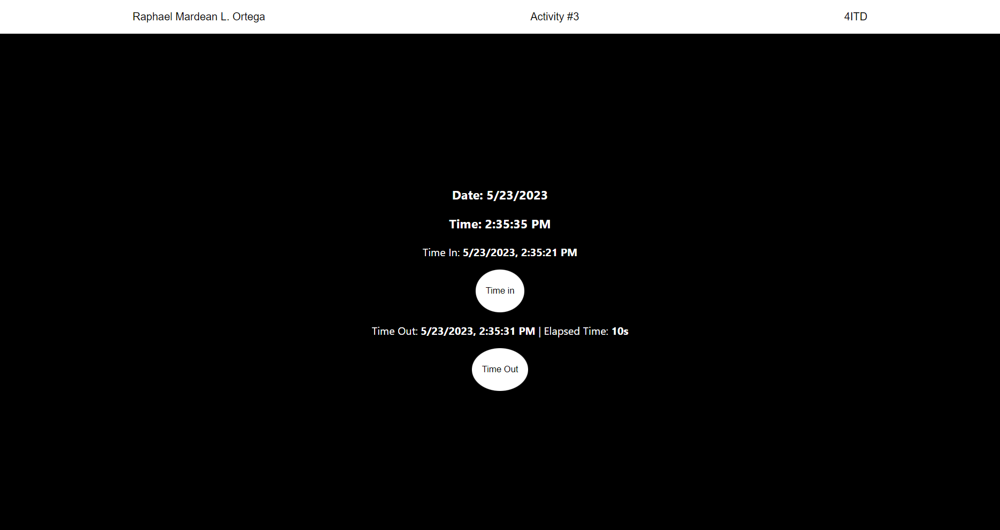

# Activity 3

A program that will display current time, time in (when button was pressed), and time out (when button was pressed). When time out button was pressed, it will display the difference between the time out and time in.

